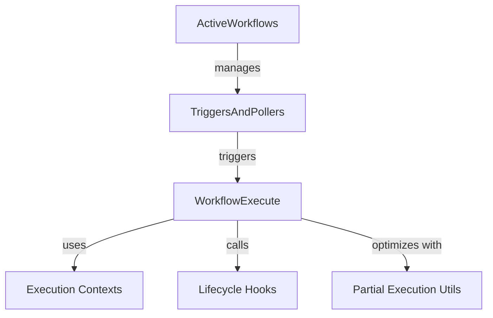
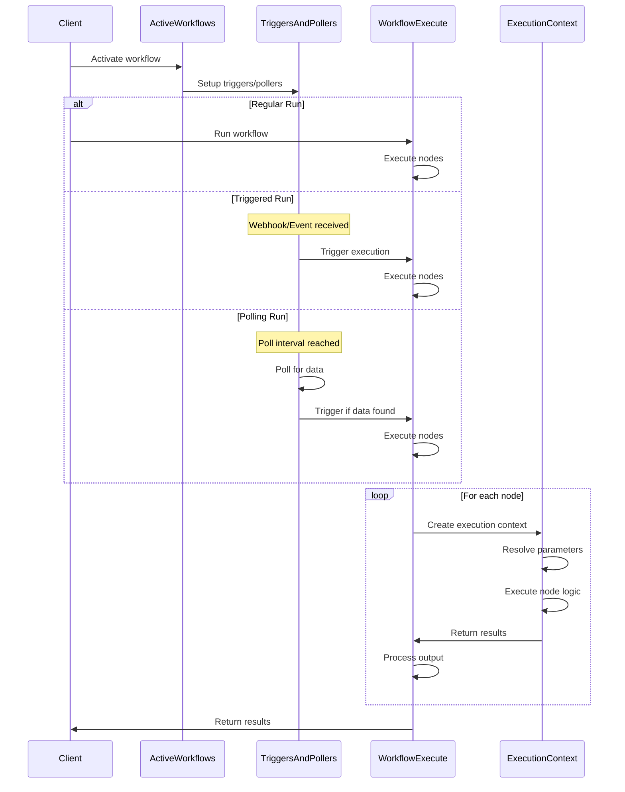
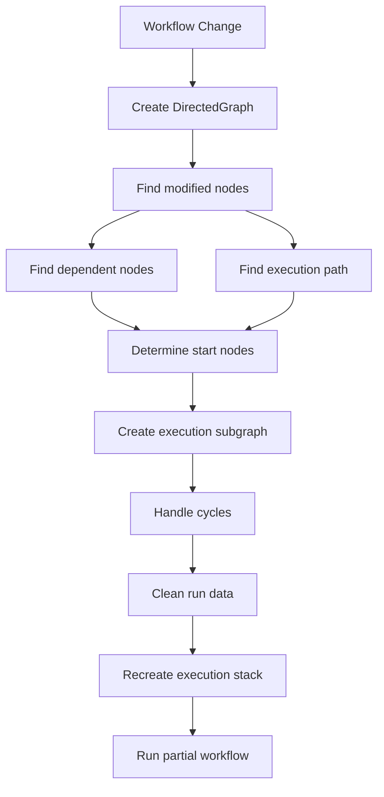

# n8n Execution Engine Architecture

This document provides a high-level overview of the n8n execution engine architecture and its components.

## Core Components

The execution engine consists of several key components that work together to execute workflows:



### WorkflowExecute

The central component responsible for executing workflows. It manages:
- The node execution stack
- Data passing between nodes
- Error handling and retries
- Partial workflow execution

### ActiveWorkflows

Manages currently active workflows that have trigger or polling nodes:
- Activates and deactivates workflows
- Sets up triggers and polling operations
- Manages workflow state in memory

### TriggersAndPollers

Handles trigger and polling nodes:
- Sets up event listeners for triggers
- Manages scheduled polling operations
- Processes incoming webhook requests
- Initiates workflow executions

### Execution Contexts

Specialized contexts for different node types and execution scenarios:
- NodeExecutionContext: Base abstract class
- ExecuteContext: Regular node execution
- WebhookContext: Webhook handling
- TriggerContext: Trigger nodes
- PollContext: Polling nodes
- And several other specialized contexts

### Execution Lifecycle Hooks

Provides hooks for workflow and node execution events:
- Before/after node execution
- Before/after workflow execution
- Supports features like monitoring and debugging

### Partial Execution Utilities

Optimizes workflow execution by only running necessary parts:
- DirectedGraph: Graph representation of the workflow
- Finding start nodes and subgraphs
- Handling cyclic dependencies
- Recreating execution state for partial runs

## Execution Flow

The high-level execution flow in n8n follows these steps:



## Data Flow

Data flows through the workflow execution as follows:

```mermaid
flowchart TD
    A[Node A Output] -->|Connection| B[Node B Input]
    B -->|Processing| C[Node B Output]
    C -->|Connection| D[Node C Input]
    
    subgraph "Data Structure"
        X[INodeExecutionData[][]]
        X -->|"Outer Array"| Y["Different outputs (main, error)"]
        Y -->|"Inner Array"| Z["Data items"]
    end
    
    subgraph "Paired Items"
        I[Input Items] -->|"Maps to"| O[Output Items]
        O -->|"Tracked via"| P["pairedItem property"]
    end
```

## Execution Modes

n8n supports different execution modes:

1. **Manual Execution**: Triggered manually by a user
2. **Webhook Execution**: Triggered by an HTTP request
3. **Polling Execution**: Triggered by periodic polling
4. **Scheduled Execution**: Triggered at specific times

## Partial Execution

Partial execution is an optimization that re-executes only the necessary parts of a workflow:



## Error Handling

The execution engine provides multiple error handling mechanisms:

1. **Node-level error handling**:
   - continueOnFail: Continue execution despite node failures
   - retryOnFail: Retry node execution multiple times
   - onError output: Route errors to specific outputs

2. **Workflow-level error handling**:
   - Error workflows: Separate workflows triggered on error
   - Error reporting: Centralized error collection and reporting
   - Error node: Handle errors within the workflow

## Extensibility

The architecture is designed to be extensible:
- Specialized node execution contexts can be added
- Additional execution lifecycle hooks can be registered
- Custom error handlers can be implemented
- Custom trigger mechanisms can be developed

## Key Design Principles

1. **Separation of concerns**: Each component has specific responsibilities
2. **Dependency injection**: Components are loosely coupled
3. **Extensibility**: New functionality can be added with minimal changes
4. **Performance optimization**: Partial execution minimizes unnecessary work
5. **Error resilience**: Comprehensive error handling at multiple levels